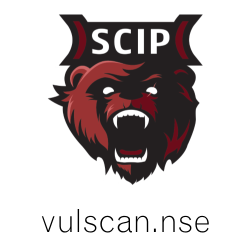

#Vulnerability Scanning with Nmap

## Giới thiệu

Vulscan là một mô-đun nmap để quét lỗ hổng. Tùy chọn nmap -sV cho phép phát hiện phiên bản trên mỗi dịch vụ được sử dụng để xác định các lỗ hổng tiềm năng theo sản phẩm được xác định. Dữ liệu được tra cứu trong phiên bản ngoại tuyến của VulDB.

## Cài đặt

Vui lòng cài đặt các tệp vào thư mục sau trong quá trình cài đặt Nmap:

    Nmap\scripts\vulscan\*

Clone GitHub repository:

    git clone https://github.com/scipag/vulscan scipag_vulscan
    ln -s `pwd`/scipag_vulscan /usr/share/nmap/scripts/vulscan    

## Sử dụng

Chạy lệnh sau đây để bắt đầu quét các lỗ hổng đơn giản:

    nmap -sV --script=vulscan/vulscan.nse www.example.com

## Cơ sở dữ liệu

Các cơ sở dữ liệu được cài đặt sẵn:

* scipvuldb.csv - https://vuldb.com
* cve.csv - https://cve.mitre.org
* securityfocus.csv - https://www.securityfocus.com/bid/
* xforce.csv - https://exchange.xforce.ibmcloud.com/
* expliotdb.csv - https://www.exploit-db.com
* openvas.csv - http://www.openvas.org
* securitytracker.csv - https://www.securitytracker.com (end-of-life)
* osvdb.csv - http://www.osvdb.org (end-of-life)

## Cơ sở dữ liệu đơn

Thực thi Vulscan với đối số sau để sử dụng một cơ sở dữ liệu:

    --script-args vulscandb=your_own_database

Cũng có thể tạo và tham chiếu cơ sở dữ liệu của riêng bạn. Điều này đòi hỏi phải tạo một tệp cơ sở dữ liệu, có cấu trúc sau:

    <id>;<title>

Chỉ cần thực hiện thủ tục như bạn muốn bằng cách tham chiếu đến một trong các cơ sở dữ liệu được phân phối trước. Hãy chia sẻ cơ sở dữ liệu và kết nối lỗ hổng của riêng bạn với tôi, để tôi thêm nó vào kho lưu trữ.

## Cập nhật cơ sở dữ liệu

Các cơ sở dữ liệu lỗ hổng được cập nhật thường xuyên. Để hỗ trợ các lỗ hổng mới nhất, hãy cập nhật cơ sở dữ liệu của bạn

Nếu muốn cập nhật cơ sở dữ liệu, hãy truy cập trang web sau và tải xuống các tệp sau:

* https://www.computec.ch/projekte/vulscan/download/cve.csv
* https://www.computec.ch/projekte/vulscan/download/exploitdb.csv
* https://www.computec.ch/projekte/vulscan/download/openvas.csv
* https://www.computec.ch/projekte/vulscan/download/osvdb.csv
* https://www.computec.ch/projekte/vulscan/download/scipvuldb.csv
* https://www.computec.ch/projekte/vulscan/download/securityfocus.csv
* https://www.computec.ch/projekte/vulscan/download/securitytracker.csv
* https://www.computec.ch/projekte/vulscan/download/xforce.csv

Sao chép các tập tin vào thư mục Vulscan:

    /vulscan/
hunganhkt@mitec.edu.vn
